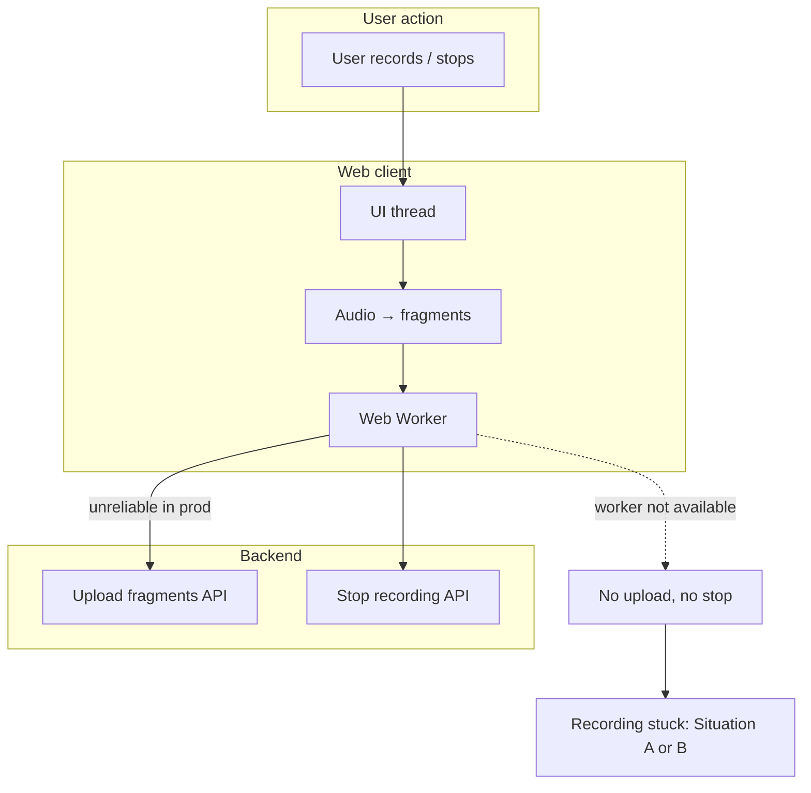
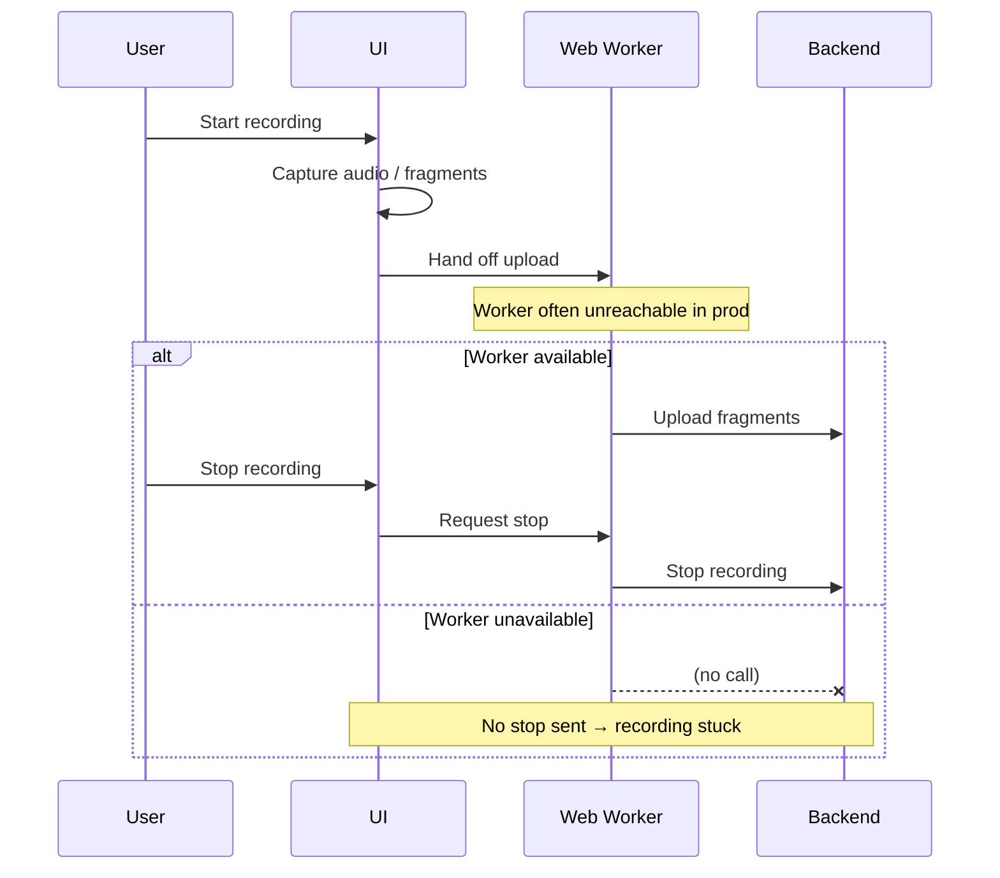
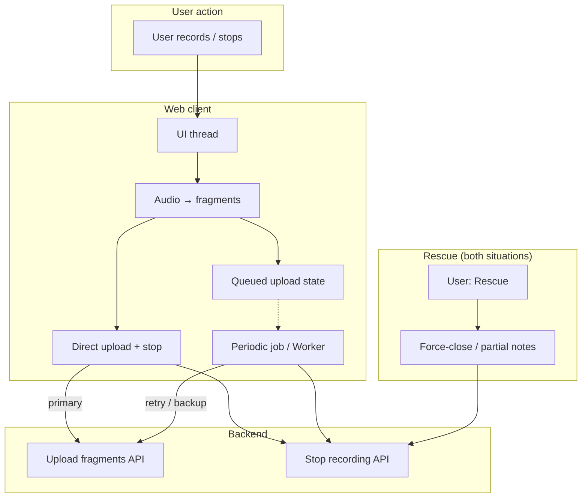
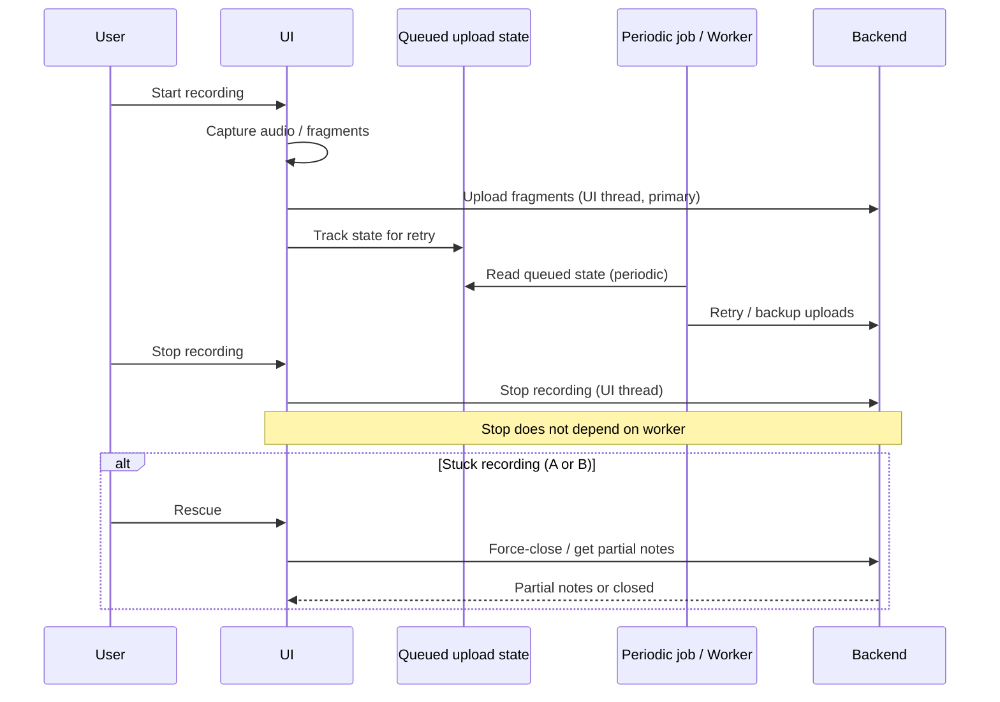

# Rescue Ongoing Recording — Problem, Current State & Solution

## 1. The Problem

There are **two distinct situations** where a recording gets stuck because the stop-recording API was never sent. Users need a way to bail out of both.

---

### Situation A: Recording ongoing on a **different** device (no stop sent)

- A recording was started on **another device** and **stop recording** was never sent (e.g. that device lost the worker, tab closed, or crashed).
- The user on **this device** **can create (or add) a new recording**.
- The user **cannot access or play** the recording that was in progress (the stuck one on the other device); that recording is effectively stuck in limbo.
- **We need to help the user bail out:** e.g. Rescue so they can clear the “ongoing” state for that stuck recording, recover partial notes if available, or close it out so the system no longer treats it as in progress.

---

### Situation B: **Same device** — stop recording API was not sent on this device

- The user is on the **same device** where the recording was made.
- For some reason the **stop recording API was never sent** on this device (e.g. web worker unreachable, tab backgrounded, or upload path failed).
- The UI shows that recording as **“X% complete”** (e.g. 18%) and it **stays stuck there** — not completed, not playable or usable in the normal way.
- The user cannot finish that recording or use it without a way to force-close it and use whatever has been captured (partial notes).
- **We need to help the user bail out:** e.g. Rescue on that dictation/recording to close it, send stop (or mark force-closed), and let them use partial notes or start a new recording.

---

### Root cause (Web)

- Upload (and thus the path that eventually sends **stop recording**) is handled by a **web worker** (“web worker revolution” / separate worker).
- In production, the app **does not get access to this worker reliably** (e.g. observed via Sentry: “web virtual revolution … not getting access to it”).
- When the worker is unavailable: fragments are not uploaded, and **stop recording** is never successfully called → recordings stay “ongoing” and either (A) the recording that was in progress cannot be accessed from this device, or (B) show as X% complete and stuck on the same device.

### Why we need Rescue for both

- **Situation A:** Without Rescue, the user has no way to access or close out that stuck recording; it remains in limbo and they cannot recover partial notes or clear the “in progress” state.
- **Situation B:** Without Rescue, the user has no way to close the stuck partial recording and use partial notes or move on; the recording just sits at X% complete.

| Situation | Where the stuck recording is | What the user sees | Rescue goal |
|-----------|-----------------------------|--------------------|-------------|
| **A** | Another device | User can create a new recording but **cannot access** the recording that was in progress (stuck on the other device) | Clear ongoing state and/or recover partial notes for that recording, or close it out |
| **B** | Same device | Recording shows “X% complete” and is stuck (e.g. 18%), not playable/usable | Close that recording and use partial notes (or start new) |

---

## 2. Current Implementation (By Platform)

### iOS
- **UI thread** → writes to **local DB**.
- A **metronome** (background process) wakes periodically, **reads from DB**, and **uploads** fragments (e.g. up to ~60 fragments efficiently).
- The metronome is **backup + sometimes primary** for uploads; there is no direct UI-thread → backend upload — persistence and upload flow go through the local DB.

### Web
- **Current:** Upload is handled by a **separate worker** (“web worker revolution”).
- **Issue:** In production, the worker is **not reliably available** → uploads (and thus stop recording) can fail → fragments stuck, “recording ongoing” forever.

### Android
- **Queue-based** model; something (e.g. a job or service) **polls the queue every ~30s** (vs ~15s on iOS).
- No major functional issue called out; conceptually similar to iOS (queue + periodic upload).

---

## 3. Before vs target implementation (Web)

### Before (current)

Upload and stop recording depend entirely on the web worker. When the worker is unavailable, nothing reaches the backend and recordings stay “ongoing.”

### Target (planned)

**Web** uses a different model than iOS: **UI thread uploads directly to the backend** (primary). A periodic job/worker acts as **retry/backup** over queued upload state — there is **no full-blown local DB** like on iOS.

---

## 4. Solution (Planned)

### A. Make UI thread the main upload path (Web)
- **Primary:** **UI thread** uploads **directly to the backend** (no local DB like iOS). When the user records or stops, the UI thread performs upload and stop in the main code path.
- **Retry/backup:** A **periodic job or worker** reads **queued upload state** (lightweight — not a full-blown DB) and retries or backs up uploads that didn’t complete. If the worker is unavailable, the UI thread still ensures uploads and stop recording can happen when the user acts.
- So: **Web (target) = UI direct upload (primary) + queued state + periodic job/worker (retry/backup)**; **iOS = UI → local DB → metronome reads DB and uploads (backup + sometimes primary)**.

### B. Rescue action for stuck ongoing recordings (both situations)
- Add a **“Rescue”** (or equivalent) action so users can **bail out** of both stuck situations.
- **Situation A (stuck recording on another device):** Rescue clears the “ongoing” state (e.g. send stop or force-close on the backend) so that recording is no longer shown as in progress; the user can recover partial notes for it if available, or simply close it out. The user can already add a new recording; Rescue addresses the inability to access or resolve the stuck recording.
- **Situation B (same device, X% complete and stuck):** Rescue on that dictation/recording closes it (send stop if possible, or mark force-closed), lets the user **use partial notes** (whatever was uploaded or is available), and frees them to start a new recording or continue.
- In both cases: treat the consult/recording as ended from the user’s perspective; allow partial notes where applicable.

### C. Situation A — no blocker for adding a recording
- When there is **an ongoing recording on another device** (or backend says recording is in progress), the user on this device **can create a new recording**.
- The user **cannot access** the recording that was in progress (the stuck one). That “ongoing” state is resolved only when:
  - A successful **stop recording** is received/processed, or
  - The user uses the **Rescue** action to force-close and recover partial notes or close it out.

---

## 5. Design References (Web Page Design folder)

- **Consult not available** – likely related to “recording ongoing” or consult unavailable states.
- **Consult / new consult** – flows for starting and continuing consults/recordings.
- **Frames 1000004081–1000004084, 1000004372** – possible recording or rescue screens.
- **Playback disabled while uploading audio** – upload/recording UX.
- **Patient name in recording screen** – in-recording UI context.
- **Prototype UI:** Styled to match Consult/Athena from this folder. If using a specific design system (e.g. MARVIX UI), replace prototype styles with that.

---

## 6. Summary

| Aspect | Before (Web) | After (Web) |
|--------|--------------|------------|
| Main upload path | Worker (unreliable in prod) | **UI thread → direct upload to backend** (primary) |
| Backup / retry | — | **Queued upload state + periodic job/worker** (retry/backup; no full DB like iOS) |
| Stuck “ongoing” state | No way to access or close stuck recording | **Rescue** action: clear ongoing state, recover partial notes or close out |
| Situation A (other device) | User can create a new recording but cannot access in-progress recording | Rescue clears state so user can recover partial notes or close that recording |

This document and the prototypes in this repo (Left_nav_revamp) focus on **documenting the problem and prototyping the Rescue flow** (clearing stuck ongoing state + rescue action) for the web product.

---

## 7. Prototype

- **Left Nav prototype (live):** Root `index.html` — also at [GitHub Pages](https://sjsaama.github.io/Left_nav_revamp/).
- **Rescue prototype:** `prototype/index.html` (if present). Run: Open in a browser, or `npx serve prototype` then open the URL.
- **Flow:** Simulated “stuck” state (recording in progress on another device, not accessible) → **Rescue** clears ongoing state and recovers partial notes or closes that recording. Use **Reset simulation** to replay. (The prototype can be extended to show the “cannot access that recording” UX and Rescue from the consult/dictation list.)
- See `prototype/README.md` for details.
